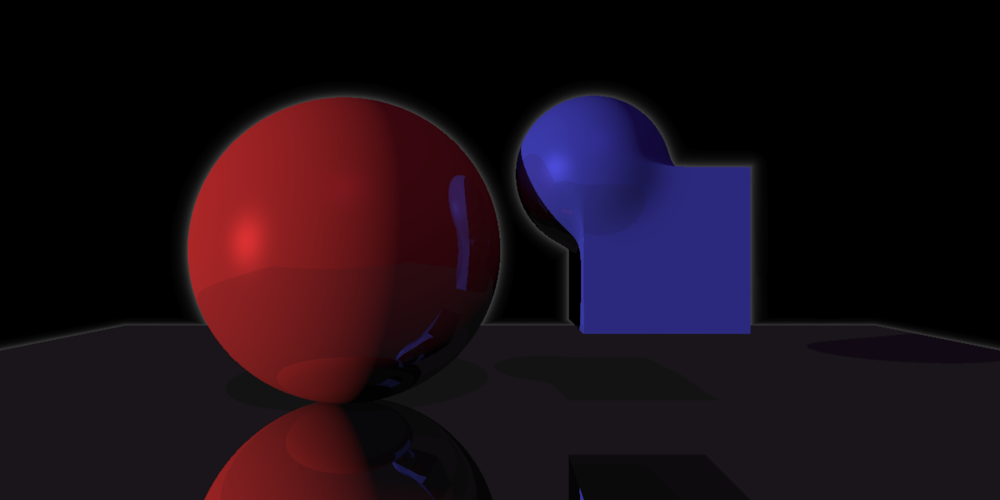

# Raymarching in rust

## TODO

- [ ] Check correctness of the render/lights effects somehow
- [ ] Load scene from external file in some format to determine (avoid compiling to change the scene)
- [ ] Modify materials to allow some kind of texture map
- [ ] Parallelize
- [ ] Multiple samples per pixel
- [ ] Cli arguments
- [ ] Improve camera, (fov, direction its pointing to)
- [ ] Refactor cast ray
- [ ] Improve loggind: add timing, some logs/verbosity option
- [ ] Better sampling using final depth + reflection + closest object infos